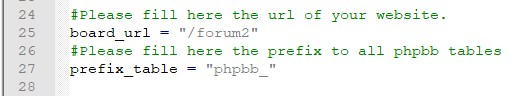

# Phpbb-live-new-post-notification
A Phpbb plugin developed to get live notifications of new posts

## Basic installation
Download the basic_installation.zip file and unzip it.
Next, go to "Configuration" step.

## Installation from sources

`````
git clone https://github.com/alexandrelefourner/Phpbb-live-new-post-notification
git clone https://github.com/Textalk/websocket-php
`````

run a composer install on Textalk websocket library... Then, move folders "lib" and "vendors" to ext\alexlf\livenewmessages\


## Configuration
They are several files to modify before starting.

### python\config.py

Modify the DATABASE_CONFIG parameters. You should put the informations required for the Python server to connect to mysql.

Please note the server only requires a read access to the tables "users" and "topics".
You should create a specific mysql user which will only have these rights (facultative, but highly recommended).
If you plan to run the server from another hardware, the firewall and mysql access should allow the other ip.

In my example, I will run on the same hardware (127.0.0.1). My database is called "forum_php_bb" and I use a root user without password. My mysql database is configured by default (port 3306).


Next, we create the internal parameter for the server.
In my example, my server adress is 79.130.XX.XXX, and I have configured my firewall to open port 9001.
I also need to set up a specific key that will be used by phpbb to be recognized. This can be anything, just take care to avoid semicolon (;).
I use daz8d94azd8az4daz6d for this example.


Next, we need to choose if we use SSL or not. If your apache server is not configured to use SSL, just keep "USE_SSL = 0" and go to "board_url" configuration.
If your board uses SSL, you will need to use SSL too. Otherwise, web browsers will not allow the connexion for safety reasons.
You will need to configure the path of your certificate and its key, and set "USE_SSL" to 1.


You will need to select the adress of the board, as it will be used for the correct redirection for the posts.
The information is available in script path from the home Admin Panel.


In my example, my board is localized in /forum2/ and I have let the default prefix for phpbb table : "phpbb_"



You can next edit the message sent to the users when a new post has been set up. (I will let it by default).

The debug variable is set to False. It gives more information about the different actions of the server.

Once done, you should install python3 if it has not yet been done. I developed the server with Python3.6.4 and it should run on all upper version.
You can download python [here](https://www.python.org/downloads/) (do not forget to install pip when it will be proposed in the installation. we need it right after !)

To install the dependancies, simply paste the following commands:

`````
pip3 install SimpleWebSocketServer
pip3 install mysql-connector 
pip3 install asyncio
`````

Once done, you can try to start the server.

python3 Server.py

If everything works fine, you should just see "Connection ok" printed.

### ext\alexlf\livenewmessages\event\main_listener.php
Modify line 66.


If you run without SSL encryption, use "ws://" as protocol. Otherwise, write "wss://".
Next, add the host of the server (it can be IP or DNS...), next the port.

For example, if I have an encrypted connexion and my dns is "www.superboard.com", running on port 9001, my line should look like :

`````php
			$client = new Client("wss://www.superboard.com:9001/");
`````
Without encryption :


`````php
			$client = new Client("ws://www.superboard.com:9001/");
`````

Next line, also requires the key of the server.

In my example, this is daz8d94azd8az4daz6d


`````php
			$client->send("1;daz8d94azd8az4daz6d;".$event["data"]["topic_id"].";".$user->data["username"].";".$event["data"]["post_id"]);
`````

### ext\alexlf\livenewmessages\styles\all\template\styles\all\template\js\websocket.js
Modify line 1 and 8 to match the correct adress of the Python server (as you did for the $client variable line 71 of main_listener).
In my example, I get the following :


### ext\alexlf\livenewmessages\styles\all\template\styles\all\template\css\alertify_alexlf_corrected.css
If you wish to change the style of the notification, you can change this file.


You are now ready to activate the extension.
- Upload the /ext/ folder to your board.
- Open a command prompt and go to the directory where the server is set up with the configuration files. Next, run the server with the following command :

```cmd
python3 Server.py```

			
# Todo list

- Solving the composer.js issue (only possible in future phpbb version)
- Using events to update the topics watched
- Managing the parameters in main_listener/js code from admin panel
- Adding color customisation from admin panel
- Create a unique key per user
- Safety against massive connections/fail connection attempts ?
- Full migration as php websocket server ? (possible to store it in an extension without running external commands ?)
